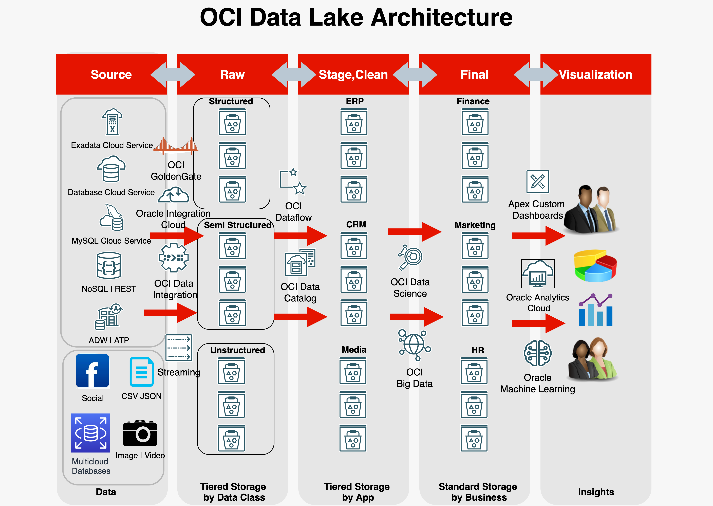
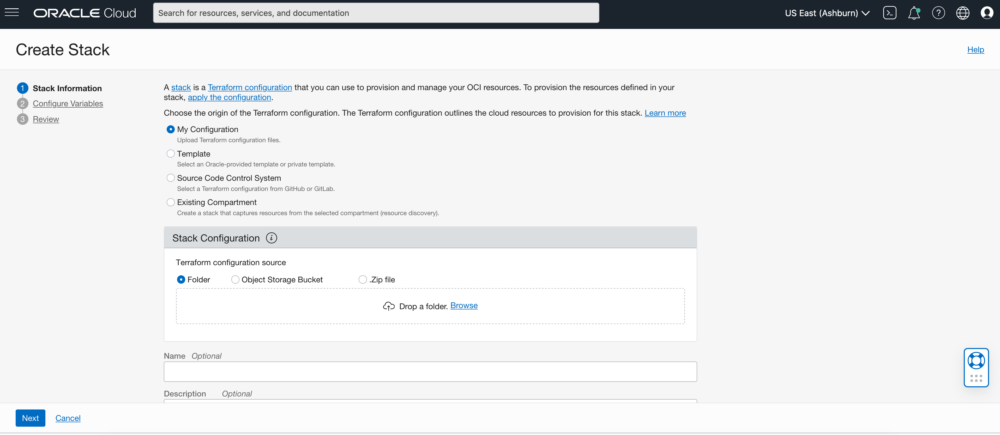

# oci-datalake

This repo is under active development.  Building open source software is a community effort.  We're excited to engage with the community building this.

## Resource Manager Deployment

This Quick Start uses [OCI Resource Manager](https://docs.cloud.oracle.com/iaas/Content/ResourceManager/Concepts/resourcemanager.htm) to make deployment easy, sign up for an [OCI account](https://cloud.oracle.com/en_US/tryit) if you don't have one, and just click the button below:

After logging into the console you'll be taken through the same steps described
in the [Deploy](#deploy) section below.

Note, if you use this template to create another repo you'll need to change the link for the button to point at your repo.

## Local Development

Make sure your credentials are defined in $HOME/.oci/config file. As Terraform takes takes the default value from the .oci/config file

For eg : [DEFAULT]
user=ocid1.user.oc1..aaaaaxxxwf3a \
fingerprint=de:50:15:13:...:d6 \
key_file=/Users/shadab/.oci/oci_api_key.pem \
tenancy=ocid1.tenancy.oc1..aaaaaaaa2txfa \
compartment=ocid1.compartment.oc1..aaaa5pti7sq \
region=us-ashburn-1

$ git clone https://github.com/oracle-quickstart/oci-datalake && cd oci-datalake

### Initialize
Initialize Terraform provider for OCI and Random

$ terraform init

### Build Plan

$ terraform plan -var-file=config.tfvars -out oci_datalake.out

### Apply

$ terraform apply "oci_datalake.out"

### Destroy

$ terraform destroy -var-file=config.tfvars

## Deploy with ORM

1. [Login](https://console.us-ashburn-1.oraclecloud.com/resourcemanager/stacks/create) to Oracle Cloud Infrastructure to import the stack
    > `Home > Solutions & Platform > Resource Manager > Stacks > Create Stack`

2. Upload the `master.zip` and provide a name and description for the stack

3. Configure the Stack. The UI will present the variables to the user dynamically, based on their selections. 
